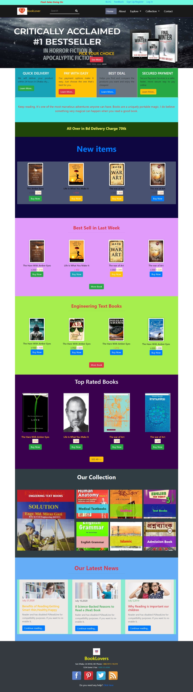
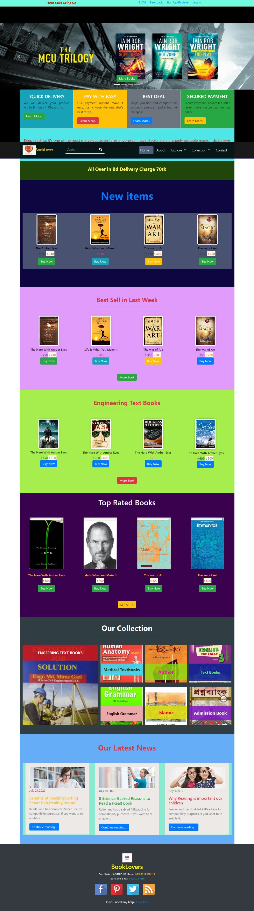

# BookShop

## Project Description

This is an online market place for books. The frontend of an online book shop. It contains one page website. The whole project is built with HTML and CSS. The website shows different categories of books.

## Built With 🧰

- HTML
- CSS

## Live Demo
The Website is published at [https://nayemhassan.github.io/BookShop](https://nayemhassan.github.io/BookShop)

- Screenshot

## Live Demo 🔴

[Live Demo Link](https://gracious-goldberg-aefc53.netlify.app/)

## Getting Started 🏁

To get a local copy up and running, follow these simple example steps.

### Prerequisites

If you are viewing this README.md file using a computer, a browser and a connection to the internet, then congratulations! You have all the prerequisites to access our project.

### Setup

1. Clone the repository to your local machine using `git clone https://github.com/NayemHassan/BookShop.git`
2. On your local machine, navigate to the BookShop folder using `cd BookShop` in your terminal
3. Once the repository has been cloned, open index.html in a browser of your choosing.
4. Enjoy!

## Authors

👤 **Md. Albin Hossain**

- Github: [@AlbinHossain](https://github.com/AlbinHossain)
- Telegram: [@MdAlbinHossain](https://t.me/MdAlbinHossain)
- Email:  albin15-12926@diu.edu.bd

👤 **Nayem Hasan**

- Github: [@NayemHassan](https://github.com/NayemHassan)
- Telegram: [@NayemHassan](https://t.me/)
- Email:  

👤 **Sayeed Anwar Rifat**

- Github: [@Rifat](https://github.com/)
- Telegram: [@Rifat](https://t.me/)
- Email:  

👤 **Raju Ahmed**

- Github: [@Raju](https://github.com/)
- Telegram: [@Raju](https://t.me/)
- Email:  

## 📝 License

This project is licensed udnder the [MIT](https://opensource.org/licenses/MIT) license.
